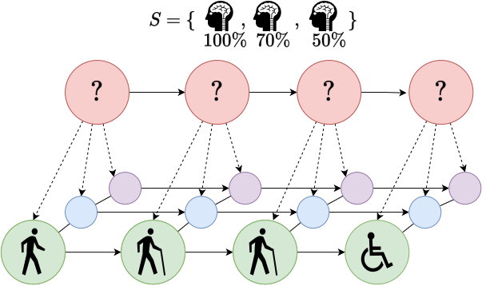

# A Generic Framework for Hidden Markov Models on Biomedical Data

<p align="center">
  
</p>

Biomedical data often contains longitudinal data, for example biomedical information on disease progress. An important goal is to infer the unknown solely from observation. Hidden Markov Models (HMMs) have been successfully applied to the processing of possibly noisy continuous signals.

This repository holds the code for a prediction tool that is able to construct a HMM-based model solely from multivariate data and a descriptive configuration file. The model construction is completely automated, for an example, please take a look at the included tutorial.ipynb file.

# Background

We provide a prediction pipeline system which processes data paired with a configuration file, enabling to construct, validate and query a fully parameterized HMM-based model. This is highly customable and accessible both to computer scientists and pracitcioners from other disciplines, for example biomedical research. The model is able to predict sequences of observable states from data. Thus, the model is able to provide any prediction capability that a HMM would offer as well, the difference being that this model predicts observable states.


# Documentation
## Installation and Usage

1) Clone/Download this repository.
2) Navigate to the folder on your machine using the commandline tool
3) (optional) create a new python environment
4) (python 3.8X required) Enter the following command into your commandline

```bash
pip install -r requirements.txt
```

5) start the tutorial notebook by entering the following command

```bash
jupyter-notebook
```

## Pipeline Documentation

* See [Documentation](https://github.com/rfechner/generic-hmm/blob/main/docs/pipeline.md)

# Contact, Supporters, Contributions and Contributing

The development of this work was carried out by several organizations:

| Organization                                             | Grant           |
|----------------------------------------------------------|---------------------------------|
| [University of Koblenz](https://www.uni-koblenz-landau.de/de/koblenz/fb3/organisation/personen/mathe/rockenfeller/robert-rockenfeller-fb3)        | Postdoc fellowship of the German Academic Exchange Service (DAAD)   |
| [University of Koblenz](https://www.uni-koblenz-landau.de/de/koblenz/fb3/organisation/personen/mathe/lehrbeauftragte/doepinghaus) | |
| [German Center for Neurodegenerative Diseases (DZNE), Bonn, Germany](https://www.dzne.de/forschung/forschungsbereiche/klinische-forschung/forschungsgruppen/klockgether/gruppenmitglieder/) | |
| University of the Sunshine Coast, Queensland, Australia | |
| University of Queensland, Brisbane, Australia |  | 

If you have questions, please use the GitHub discussions feature at
https://github.com/rfechner/generic-hmm/issues/new.


# Citation

If you use this work, please cite:

```bibtex
@article{dorpinghaus2022context,
  title={Context mining and graph queries on giant biomedical knowledge graphs},
  author={D{\"o}rpinghaus, Jens and Stefan, Andreas and Schultz, Bruce and Jacobs, Marc},
  journal={Knowledge and Information Systems},
  volume={64},
  number={5},
  pages={1239--1262},
  year={2022},
  publisher={Springer}
}
```
