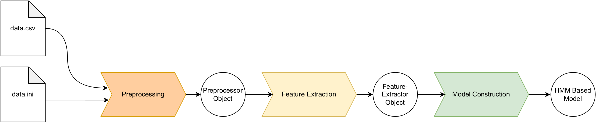
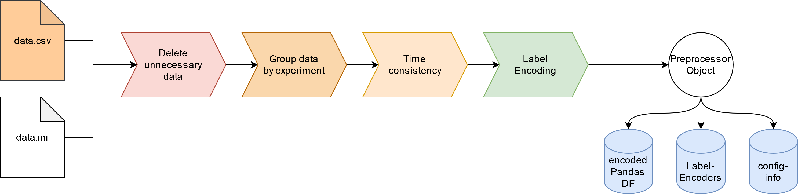

# Pipeline Documentation

The prediction pipeline was written in Python, making use of the ``hmmlearn`` library. The pipeline is made up of a pre-processing stage, a feature extraction stage, and a prediction stage. To obtain a trained model, the user must input their training data in the form of a .csv file as well as a .ini config file, describing the layer structure and provide sufficient information about the weights of the model.

## User Input 

The data consisting of the different observations made in the form of a .csv file, as well as the configuration of the model in the form of a .ini file, must be supplied by the user. The .ini file must conform to a given abstract syntax which we will discuss in the following.


<p align="center">
  
</p>

The abstract syntax outlines the correct way of specifying a .ini file required to construct a model, whilst making no assumption about the form of the data. It is written in a metalanguage called Backus Naur Form or BNF for short. Each marker in the data which the user wants to be integrated into the model must be specified as a section inside the .ini file. Additionally, information about the datatype, related layer, and layer-specific weight of the marker must be supplied as a key-value pair under the corresponding markers section. Optional information, like the relationship to other markers, can be added.

An important aspect of the data is the grouping of observations and the measurement interval. The user can specify the group key or primary key of the data, by which each observation instance is identified, as well as a maximum time delta in between two consecutive measurements under the meta-information section as key-value pairs. Omitting both key-value pairs will result in an interpretation of the data as one large observation sequence, where the consistency of the length of the time intervals in between observations is unimportant. Of course, this is not advised, as the time interval between observations does matter a lot for most cases. Inconsistencies in this regard are sure to distort results, or at least lessen the value of any made prediction by the model.

To give a short example, see the following example .csv file and its corresponding .ini file. 

| **Person** | **Date** | **Snow** | **Temp** | **Chocolate Type** | **Xmas Lights** |
|------------------|----------------|----------------|----------------|--------------------------|-----------------------|
| henry            | 2020-12-01     | yes            | -0.2           | none                     | 1                     |
| henry            | 2020-12-02     | no             | 2.1            | nougat                   | 3                     |
| henry            | 2020-12-03     | no             | 3.0            | white                    | 5                     |
| henry            | 2020-12-04     | yes            | 1.0            | nougat                   | 4                     |
| scarlet          | 2020-12-06     | yes            | -0.3           | nougat                   | 3                     |
| scarlet          | 2020-12-08     | yes            | 0.2            | none                     | 2                     |
| scarlet          | 2020-12-02     | yes            | -1.2           | white                    | 1                     |
| scarlet          | 2020-12-12     | yes            | -3.0           | cacao                    | 14                    |
| scarlet          | 2020-12-24     | yes            | -1.0           | dark                     | 42                    |

``` 
[markerconfig_metainfo]
groupby=Person
dateinfo=('Date', '2020-12-24', '2020-12-25')

[Person]
dtype=discrete
layerName=personal
layerSpecificWeight = 1

[Date]
dtype=discrete
layerName=measurement
layerSpecificWeight = 1

[Snow]
dtype=discrete
layerName=weather
layerSpecificWeight = 0.5

[Temp]
dtype=linspace(-10,10,20)
layerName=weather
layerSpecificWeight = 0.5

[Chocolate Type]
dtype=discrete
layerName=goodies
layerSpecificWeight=0.8

[Xmas Lights]
dtype=linspace(0,50,10)
layerName=goodies
layerSpecificWeight=0.2
``` 

In the example, we have two observation sequences, one observed by henry, and the other one observed by scarlet. Both have marked their observations for different markers in the corresponding columns and added a date of observation. In the corresponding .ini file we have specified by which column to group the observations under the ``markerconfig\_metainfo`` section. Additionally, we have connected the markers *Snow* and *Temp* to the *weather*-layer and the markers *Chocolate Type* and *Xmas Lights* to the *goodies*-layer. For each marker, we have specified a datatype, notably there exists a linspace datatype which given the fitting parameters specified in the abstract syntax is able to discretize continuous or already discrete values into categories. This feature is especially important since this kind of discretization allows us to generalize and enable the HMM to work with continuous values it has never seen before. The abstract syntax also allows for discretization of timestamps, which is just another example of a continuous datatype.

It should be noted that, although the definition of a marker calls for the existence of a layer-specific weight, the program is robust against missing or faulty weights and will re-balance the given weights to satisfy stochastic constraints.

## Pre-processing

Pre-processing is a modular stage inside the pipeline, which itself is a small pipeline. The transformation of the data supplied includes the analysis of the .ini file, deletion of any unnecessary data, the grouping of the data according to the metainformation extracted from the .ini file, enforcing measurement interval consistency if necessary, and finally encoding the data into a less memory intensive format.

<p align="center">
  
</p>

 The label encoding transformation is a standard procedure ensuring a stable workflow as well as providing a point of standardized contact with the following components (or interface for short), at which the single previous or latter components of the pipeline might be easily switched out or modified. This practice ensures modularity, besides reducing the amount of memory used to store the observation sequences. For convenience, the whole pre-processing is fully automated and can be called in a few lines of code:

```
from pre-processing import Preprocessor

path_to_config = "./data.ini"
path_to_data = "./data.csv"

prep = Preprocessor(debug=False)
prep.process(path_to_config=path_to_config,
             path_to_data=path_to_data,
             csv_delimiter=',')
```

## Feature Extraction

The Feature Extraction builds upon the previous step in the pipeline, the pre-processing. Just as the prior component of the pipeline, the feature extraction component is fully modularized implementing the necessary interface used to provide the required functionality to the next part in the pipeline. Inside the feature extraction stage, the **state transition**-, **signal emission**- and **initial state**-probabilities are extracted from the encoded data supplied by the pre-processing stage. This is an important step since we can use the extracted probabilities later on to construct HMMs with a strong initial guess for $\mathcal{A}, \mathcal{B}$ and $\pi$.

<p align="center">
  
</p>

Again, for convenience, the feature extraction can be written in a few lines of code.

```
from pvault import ProbabilityVault

# build ontop of the already existing Preprocessor object
pv = ProbabilityVault(prep, debug=False)
pv.extract_probabilities()
```

## Model Validation and Query

Finally, in the last step of the pipeline, the HMM-based model is constructed and queried. Building on top of the previously constructed feature extraction, the actual construction of the different HMMs is very convenient. In the implementation, we heavily rely on the hmm-learn library and its implementation of the Multinomial Hidden Markov Model. All that is left is the interpolation of the results given by the individual HMMs according to the weights specified inside the .ini config-file. To give a measure of success, the model is able to compute the multi-class $F_1$-Score for a given validation dataset. Model construction and validation can be executed in a few lines of code, as we will see below. 

```
import pandas as pd
from model import RHMM

path_to_validation_data = "./validation.csv"

# load validation dataset, split into groups
validation_df = pd.read_csv(path_to_validation_data, delimiter=',')
validation_samples = prep.group_df(validation_df)


# build model on top of already contructed ProbabilityVault object
rhmm = RHMM(pv, debug=False)
f1_score = rhmm.validate(   groups=validation_samples,
                            layers=['layer1', 'layer2'],
                            hidden_marker='marker1')

```

As already stated, it is important to understand that the HMM-based model can only offer predictions that a simple single observation HMM could offer as well. These predictions include the following:

* **Posteriors for each hidden state for observation $\mathcal{O}$**  Given a Query $\mathcal{Q}$, compute the posterior distribution for each hidden state of $M_{\mathcal{H}}$ for every timestep $t$ given the trails $T_i$. The result will be a weighted sum (according to the weights defined in $\mathcal{Q}$) of the individually computed posteriors.
* **Distribution over hidden states following $\mathcal{O}$**     Given a Query $\mathcal{Q}$, predict the distribution over the hidden states of $M_{\mathcal{H}}$ for possibly many timesteps $\hat{t}$ following the observation. This yields an approximation to a stationary distribution of the state transition matrix for $M_{\mathcal{H}}$. The kind of stationary distribution is dependent on the initial state distribution given by the observation sequence $\mathcal{O}$.
* **Optimal state sequence**    Given a Query $\mathcal{Q}$, compute the optimal state sequence of $M_{\mathcal{H}}$ *best explaining* the trails $T_i$ using the Viterbi Algorithm.

## Controller

To wrap all of these components up, and use the whole pipeline, as well as enable plotting of the results, a wrapper object called \texttt{Controller} provides a user friendly interface.\vspace{0.5cm}

```
from controller import Controller

# construct model
c = Controller()
c.construct(path_to_data="data.csv",
            path_to_config="data.ini",
            csv_delimiter=",")

# validate model           
c.validate(path_to_validation_data="validation.csv",
           csv_delimiter=",",
           hidden_marker="marker1",
           layers=["layer1", "layer42"])

# query model        
c.plot_posterior_distribution(path_to_observation="single.csv",
                            csv_delimiter=",", 
                            hidden_marker="marker1", 
                            layers=["layer1"])
```

In most cases, we would like to test the performance of our model on a specific dataset more rigorously. This is archived with the so-called *k*-fold cross validation, a way of reducing uncertainty over the performance of a model on a dataset. The model is continuously trained and tested on randomized parts of the whole dataset, resulting in multiple measurements of model performance. The Controller provides a simple method interface for the *k*-fold cross validation of a given dataset. 

```
from controller import Controller

path_to_data = "data/train.csv"
path_to_config = "data/train.ini"

c = Controller()

f1_scores = c.kfold_cross_validation(k = 10,
                          path_to_data=path_to_data,
                          path_to_config=path_to_config,
                          csv_delimiter=',',
                          layers=["layer1", "layer2", "layer3"],
                          hidden_marker='hidden_marker')
```

